# TextFind RFCs & Execution Economy Research

Public architectural disclosures, RFCs, research documents, and conceptual foundations supporting TextFind, PER, the Execution Economy, Intelligence Economics, and Knowledge Compounding Theory.

See [PUBLICATIONS.md](./PUBLICATIONS.md) for related publications, discussions, and disclosures.

See [LEGAL.md](./LEGAL.md) for intellectual property, licensing, and usage terms.

---

# 📌 Executive Summary

TextFind and PER explore a shift from AI systems focused solely on generation toward systems focused on governed execution.

The central premise is:

> Intelligence alone does not create value.
>
> Value emerges when intelligence participates in governed execution that produces outcomes for beneficiaries.

This body of work explores:

* Execution Governance
* Execution-Time Enforcement
* Runtime Trust & Authority
* Execution Artifacts
* Capability Publication & Composition
* Value Attribution
* Intelligence Economics
* Capability Formation
* Knowledge Compounding

Together, these works explore a broader progression:

```text
Experiences
      ↓
Durable Concepts
      ↓
Capability
      ↓
Execution
      ↓
Value
```

---

# 📚 Thesis

The primary conceptual document for this body of work is:

**[TF-THESIS-0001-REV3 – Evolution Toward the Execution Economy](../theses/TF-THESIS-0001-REV3-EVOLUTION-TOWARD-THE-EXECUTION-ECONOMY.md)**

The thesis introduces:

* Participants
* Executions
* Artifacts
* Outcomes
* Beneficiaries
* Value Propagation
* Governed Execution
* Execution-Time Governance
* Future Execution Economies

---

# 🧭 Recommended Reading Path

For readers new to the project:

### Vision

1. TF-THESIS-0001-REV3 – Evolution Toward the Execution Economy

### Foundations

2. TF-RFC-0007 – Execution Economy
3. TF-RFC-0008 – Governable Execution Infrastructure

### Runtime Governance

4. TF-RFC-0009 – Trusted Processing Elements
5. TF-RFC-0010 – Execution Artifact Authority

### Capability Ecosystem

6. TF-RFC-0011 – Governed Execution Capabilities

### Intelligence Economics

7. TF-RFC-0012 – Intelligence Economics and Effective Intelligence Units

### Learning & Capability Formation

8. TF-RFC-0013 – Knowledge Compounding Theory (KCT)

---

# 🧠 RFC Overview

| RFC         | Title                                                         | Focus                                            |
| ----------- | ------------------------------------------------------------- | ------------------------------------------------ |
| TF-RFC-0001 | Execution Receipts                                            | Verifiable execution outputs                     |
| TF-RFC-0002 | Execution Provenance Graph                                    | Causal tracing                                   |
| TF-RFC-0003 | XPO                                                           | Cross-platform execution                         |
| TF-RFC-0004 | Execution Governance Model                                    | Runtime governance                               |
| TF-RFC-0005 | AI Adoption Guidelines                                        | Organizational adoption                          |
| TF-RFC-0006 | Execution-Time Governance                                     | Runtime control                                  |
| TF-RFC-0007 | Execution Economy                                             | Execution participation                          |
| TF-RFC-0008 | Governable Execution Infrastructure                           | Governable systems                               |
| TF-RFC-0009 | Trusted Processing Elements                                   | Trust and delegated execution                    |
| TF-RFC-0010 | Execution Artifact Authority                                  | Governed artifacts                               |
| TF-RFC-0011 | Governed Execution Capabilities                               | Publication and composition                      |
| TF-RFC-0012 | Intelligence Economics and Effective Intelligence Units (EIU) | Intelligence measurement and execution economics |
| TF-RFC-0013 | Knowledge Compounding Theory (KCT)                            | Capability formation and learning investments    |

---

# 🏗 Repository Structure

```text
TextFind
├── theses/
│   ├── TF-THESIS-0001-REV3
│   └── TODO/
│
├── textfind-rfcs/
│   ├── TF-RFC-0001 ... TF-RFC-0013
│   ├── diagrams/
│   └── screenshots/
│
└── implementations/
```

---

# 🚀 Evolution of the Research

```mermaid
flowchart LR
    A[Execution Receipts]
        --> B[Execution Provenance Graph]
        --> C[XPO]
        --> D[Execution Governance]
        --> E[AI Adoption Guidelines]
        --> F[Execution-Time Governance]
        --> G[Execution Economy]
        --> H[Governable Execution Infrastructure]
        --> I[Trusted Processing Elements]
        --> J[Execution Artifact Authority]
        --> K[Governed Execution Capabilities]
        --> L[Intelligence Economics]
        --> M[Knowledge Compounding Theory]
```



---

# 🌐 Execution Economy

The Execution Economy emerges when execution itself becomes:

* measurable
* governed
* attributable
* composable
* trusted
* economically meaningful

The focus shifts from:

```text
AI Generation
```

to:

```text
Governed Execution Participation
```

---

# 📊 Intelligence Economics

TF-RFC-0012 extends the Execution Economy toward the measurement of intelligence contribution.

Research areas include:

* Intelligence Units (IU)
* Effective Intelligence Units (EIU)
* Intelligence Efficiency
* Cost per Intelligence Unit (CIU)
* Intelligence as a latent variable
* Intelligence contribution estimation

Current status:

```text
Research / Exploratory
```

No implementation is currently planned.

---

# 🧠 Knowledge Compounding Theory (KCT)

TF-RFC-0013 extends the research into capability formation and learning investments.

The RFC explores:

* Experience Extraction
* Durable Concepts
* Knowledge Lifecycle Models
* Knowledge Portfolio Models
* Knowledge Network Effects
* Domain Transferability
* AI Amplification Hypothesis
* The Forty-Year Test

Central premise:

> Learning is not merely the accumulation of knowledge.
>
> It is the extraction of durable concepts from experiences.

KCT examines why some learning investments continue generating value across decades while others rapidly depreciate, and explores how Artificial Intelligence may increase the returns of highly connected, transferable, and compounding knowledge assets.

Current status:

```text
Research / Exploratory
```

---

# 🧩 Relationship to TextFind + PER

### TextFind

Operational Control Plane

### PER

Pipeline Execution Runtime

Governed Execution Runtime

Together:

```text
Control Plane
      +
Governed Execution Runtime
```

Supported by:

```text
Capability Formation Research
      +
Execution Economics Research
```

---

# 📜 Licensing & IP

All RFCs and theses:

* establish prior art
* document conceptual frameworks
* describe implementation-independent models
* support future research and implementation

Released under:

```text
CC BY 4.0
```

---

# 🔥 Key Ideas

> The future of AI systems is not defined by intelligence alone.

It is defined by:

* governed execution
* trusted participation
* runtime authority
* execution accountability
* value attribution
* measurable outcomes
* intelligence efficiency

And perhaps equally important:

> The future of human capability is not defined by the amount of information acquired.
>
> It is defined by the durable concepts extracted from experience and their ability to continue generating value across time, domains, and future learning.

---

# Author

Nicolae Dumitru Caralicea

CaralisLabs / TextFind
