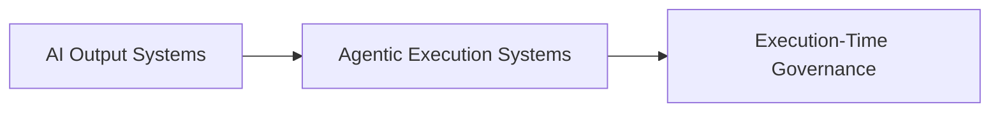

## Publications

See [PUBLICATIONS.md](./PUBLICATIONS.md) for related posts and discussions.


# TextFind RFCs

This repository contains a series of Request for Comments (RFCs) describing the architecture, principles, and evolution of **TextFind + PER**.

These RFCs define a unified model for:

- execution-centric system design  
- AI integration within controlled pipelines  
- runtime governance for agentic systems  
- traceability and provenance of execution  

See [LEGAL.md](./LEGAL.md) for intellectual property and usage terms.

---

## 📌 Core Thesis

> AI systems should not be evaluated only by what they generate.  
>  
> They must be evaluated by what they **execute**.

TextFind + PER introduces an architecture where:

```
Agent → Action → Governance → Receipt → Provenance
```

---

## 🧠 RFC Overview

| RFC | Title | Focus |
|-----|------|------|
| [TF-RFC-0001](./TF-RFC-0001-EXECUTION-RECEIPTS.md) | Execution Receipts | Verifiable execution outputs |
| [TF-RFC-0002](./TF-RFC-0002-EXECUTION-PROVENANCE-GRAPH.md) | Execution Provenance Graph | Causal tracing of actions |
| [TF-RFC-0003](./TF-RFC-0003-XPO.md) | XPO (Execution Policy Orchestration) | Cross-system execution control |
| [TF-RFC-0004](./TF-RFC-0004-EXECUTION-GOVERNANCE.md) | Execution Governance Model | Runtime enforcement model |
| [TF-RFC-0005](./TF-RFC-0005-AI-ADOPTION-GUIDELINES.md) | AI Adoption Guidelines | Structured AI integration |
| [TF-RFC-0006](./TF-RFC-0006-EXECUTION-TIME-GOVERNANCE.md) | Execution-Time Governance | Runtime control for agentic AI |

---

## 🚀 Evolution of the Model


---

## ⚙️ Architectural Direction

The RFCs collectively define a system where:

- execution is **explicitly modeled**
- AI operates within **bounded pipelines**
- actions are governed at **runtime**
- every execution produces **verifiable evidence**

---

## 🔐 Why This Matters

Agentic AI systems introduce:

- autonomous action execution  
- cross-system interactions  
- real-world consequences  

This requires a shift:



---

## 🧩 Relationship to TextFind + PER

These RFCs describe the architectural foundation of:

- **TextFind Platform** → Control Plane  
- **PER (Pipeline Execution Runtime)** → Execution + Governance Layer  

Together:

```
Control Plane + Governed Execution Runtime
```

---

## 📖 Usage

These RFCs are:

- architectural specifications  
- design references  
- prior art documentation  
- system design guidelines  

They are intended for:

- system architects  
- AI engineers  
- platform designers  
- organizations adopting agentic AI  

---

## 📜 Licensing & IP

All RFCs in this repository:

- represent pre-existing intellectual property  
- establish prior art for described concepts  
- are released under **CC BY 4.0**  

See individual RFCs for detailed terms.

---

## 🔥 Key Idea

> The future of AI systems is not defined by intelligence alone.  
>  
> It is defined by **controlled execution**.

---

## Author

Nicolae Dumitru Caralicea  
CaralisLabs / TextFind