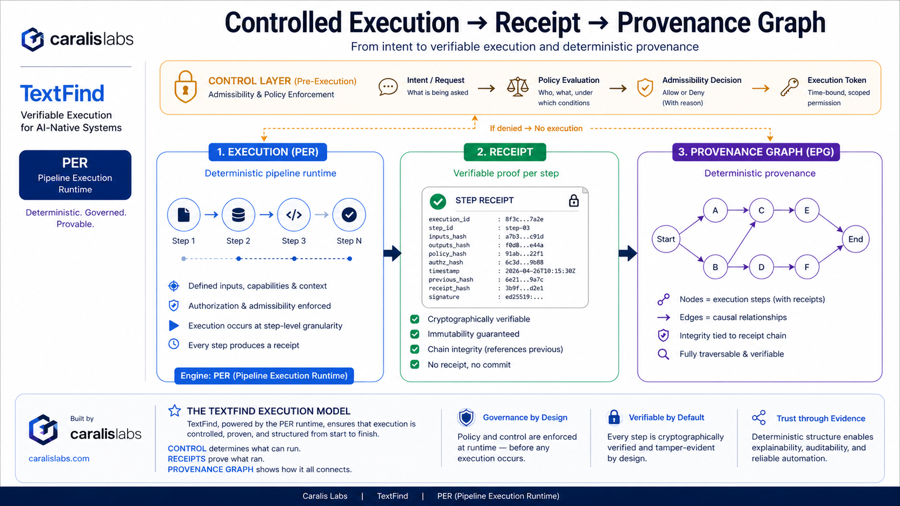

# TextFind RFCs

This repository contains technical specifications defining execution governance and verifiable execution models.

## RFCs

- TF-RFC-0001: Execution Receipts
- TF-RFC-0002: Execution Provenance Graph (EPG)
- TF-RFC-0003: Cross-Platform Execution & Outcome Protocol (XPO)

These documents define execution as a first-class verifiable construct, rather than an emergent property of system logs.

## Execution Model

