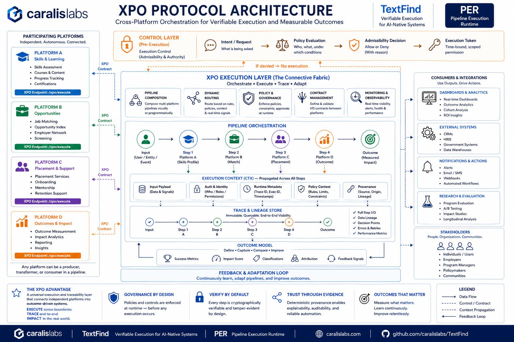

# TF-RFC-0003: Cross-Platform Execution & Outcome Protocol (XPO) (Publication-Grade)

* **Status**: Draft
* **Author**: Nicolae Dumitru Caralicea
* **Created**: 2026-04-27
* **Updated**: 2026-04-27
* **Related RFCs**: TF-RFC-0001, TF-RFC-0002

---

## Abstract

This document defines the **Cross-Platform Execution & Outcome Protocol (XPO)**—a standardized model for executing **pipelines across independent platforms** with **end-to-end traceability and measurable outcomes**.

XPO introduces a missing layer in modern systems:

> **Execution across boundaries with deterministic traceability and outcome awareness**

XPO focuses on the execution layer, independent of any specific application domain.

---

## Architecture Overview
The XPO Protocol enables cross-platform execution through a shared orchestration and traceability layer:



> **Figure 1** — XPO Protocol Architecture: Cross-platform orchestration, execution traceability, and outcome-driven feedback loops across independent systems.

---


## 1. Problem Statement

Modern systems are fragmented:

* Platforms operate in isolation
* Execution is not traceable across boundaries
* Outcomes cannot be linked to actions

This leads to:

* lack of accountability
* inability to optimize systems
* disconnected value flows

---

## 2. Core Principle

> Execution MUST be traceable across system boundaries and MUST preserve causal linkage between actions and outcomes.

---

## 3. Execution Model

### 3.1 Pipeline Definition

A pipeline is a directed graph of execution steps:

```json
{
  "steps": [
    {"id": "step_1", "platform": "A"},
    {"id": "step_2", "platform": "B"}
  ],
  "edges": [
    {"from": "step_1", "to": "step_2"}
  ]
}
```

This representation is illustrative and does not mandate a graph-based execution model.

The trace graph MAY be backed by deterministic provenance systems (e.g., execution provenance graphs).

---

### 3.2 Execution Context (CTX)

```json
{
  "ctx": {
    "input": {},
    "auth": {},
    "runtime": {
      "trace_id": "uuid",
      "execution_id": "uuid"
    }
  }
}
```

---

### 3.3 Cross-Platform Invocation

Each platform MUST expose:

```
POST /xpo/execute
```

The endpoint MUST accept a standardized execution payload including context, pipeline segment, and contract definitions.

---

## 3.4 Implementation Abstraction

This RFC defines a protocol-level abstraction for cross-platform execution.

It does NOT prescribe:
- internal pipeline representations
- execution DSLs
- scheduling strategies
- data mapping mechanisms

Implementations MAY use:
- graph-based models
- contract-based mappings
- event-driven execution
- or other internal paradigms

The protocol only requires that:
- execution can be invoked
- context can be propagated
- outputs can be produced
- traces can be emitted

Some implementations may use explicit contract-bound data mappings instead of structural edges.

This specification defines interoperability requirements only and does not constrain internal execution semantics.

---

## 4. Outcome Model

```json
{
  "success": true,
  "score": 0.91,
  "classification": "high_fit"
}
```

Outcomes are:

* first-class outputs
* comparable across executions
* required for optimization

Outcomes SHOULD be defined in a way that enables cross-system comparability and aggregation.

---

## 5. Traceability Model

Execution MUST produce a trace graph:

```json
{
  "nodes": ["step_1", "step_2"],
  "edges": [{"from": "step_1", "to": "step_2"}],
  "outputs": {},
  "integrity": {"verifiable": true}
}
```

Traceability MUST preserve causal relationships between execution steps and final outcomes.

---

## 6. Invariants

The system MUST guarantee:

1. **Cross-boundary determinism**
2. **Complete traceability**
3. **Explicit contracts**
4. **Outcome binding**

---

## 7. Policy & Control Layer

Execution MUST support:

* admissibility checks
* policy enforcement
* scoped execution tokens

Example:

```json
{
  "policy": {
    "allow": true,
    "constraints": {
      "max_cost": 5
    }
  }
}
```

---

## 8. Security Model

* Execution integrity MUST be verifiable
* Context MUST be authenticated
* Outputs MUST be attributable

---

## 9. Adversarial Considerations

The system MUST prevent:

* hidden execution steps
* unauthorized cross-platform calls
* data tampering
* outcome manipulation

---

## 10. Comparison

| Feature         | Traditional Systems | XPO            |
| --------------- | ------------------- | -------------- |
| Execution Scope | Single system       | Cross-platform |
| Traceability    | Partial             | End-to-end     |
| Outcomes        | Indirect            | Explicit       |
| Adaptability    | Low                 | High           |

---

## 11. Example Use Case

**Skill → Opportunity Pipeline**

* Platform A: skill evaluation
* Platform B: opportunity matching
* Platform C: outcome measurement

Final result:

```json
{
  "success": true,
  "score": 0.82
}
```

---

## 12. Conclusion

XPO transforms execution from:

> isolated actions → connected, traceable, and outcome-driven systems

---

## Key Statement

> Execution is not confined — it is connected, causally traced, and outcome-driven.

---

## 13. Claims Scope (Informal)

This document establishes prior art for:

* Cross-platform execution pipelines
* Execution-bound outcome modeling
* Context propagation across systems
* Policy-controlled distributed execution

---

## 14. Execution Guarantees

A system implementing XPO MUST guarantee:

1. **End-to-End Execution Visibility**
2. **Deterministic Cross-System Flow**
3. **Outcome Attribution**
4. **Policy-Enforced Execution**

---

## 15. IP & Licensing Considerations

This RFC is intended as a **publication-grade disclosure** to:

* establish prior art
* enable ecosystem collaboration
* protect architectural concepts

Implementations may:

* extend this protocol
* optimize internal execution
* remain proprietary

This document does not grant rights to any specific implementation, internal architecture, or proprietary execution model.

---

## 16. License

This document is released under the **Creative Commons Attribution 4.0 International (CC BY 4.0)** license.

You are free to:

* Share
* Adapt
* Build upon

Provided that:

* Proper credit is given to the author

---

## 17. Final Note

XPO does not define future systems.

It defines:

> **how future systems can be executed, connected, and improved**
