# TF-RFC-0006
## Execution-Time Governance for Agentic Systems
### A Runtime Control Architecture for AI Execution

---

**Status:** Draft  
**Version:** 1.1  
**Author:** Nicolae Dumitru Caralicea  
**Organization:** CaralisLabs / TextFind  
**Created:** 2026-05-02  

---

## 1. Abstract

Agentic AI systems introduce a fundamental shift in computing:

- from output generation  
- to execution of actions in real-world systems  

Existing AI architectures focus on model correctness and pre-deployment validation. These approaches are insufficient for systems that:

- plan multi-step actions  
- invoke external tools  
- modify external state  
- adapt during execution  

This document defines **Execution-Time Governance (ETG)**:

> A system architecture where all AI-initiated actions are evaluated, constrained, and enforced at runtime before execution.

Execution-Time Governance introduces:

- execution boundaries  
- runtime policy enforcement  
- dynamic authority resolution  
- verifiable execution traces  
- execution provenance graphs  

---

## 2. Motivation

Organizations deploying AI agents face:

- uncontrolled automation  
- unclear responsibility boundaries  
- lack of traceability  
- increasing regulatory exposure  

These issues arise from a core gap:

> AI systems are allowed to act without a governing execution layer.

---

## 3. Problem Statement

Current architecture:

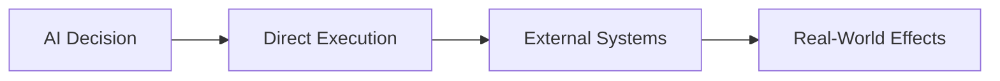

This leads to:

- non-enforceable constraints  
- implicit execution logic  
- inability to control runtime behavior  
- lack of auditability  

### Required Shift

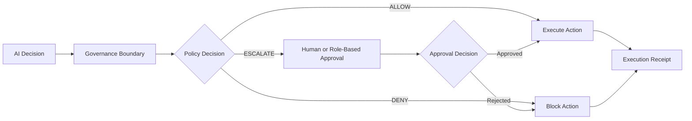

---

## 4. Design Goals

Execution-Time Governance must provide:

- **Enforceability** — actions cannot bypass runtime control  
- **Observability** — all actions are traceable  
- **Determinability** — governance decisions are explainable  
- **Adaptability** — policies react to runtime context  
- **Composability** — supports multi-step pipelines and agent workflows  
- **Auditability** — every action produces evidence  

---

## 5. Core Concepts

### 5.1 Execution Boundary

A mandatory control layer that intercepts all AI actions before execution.

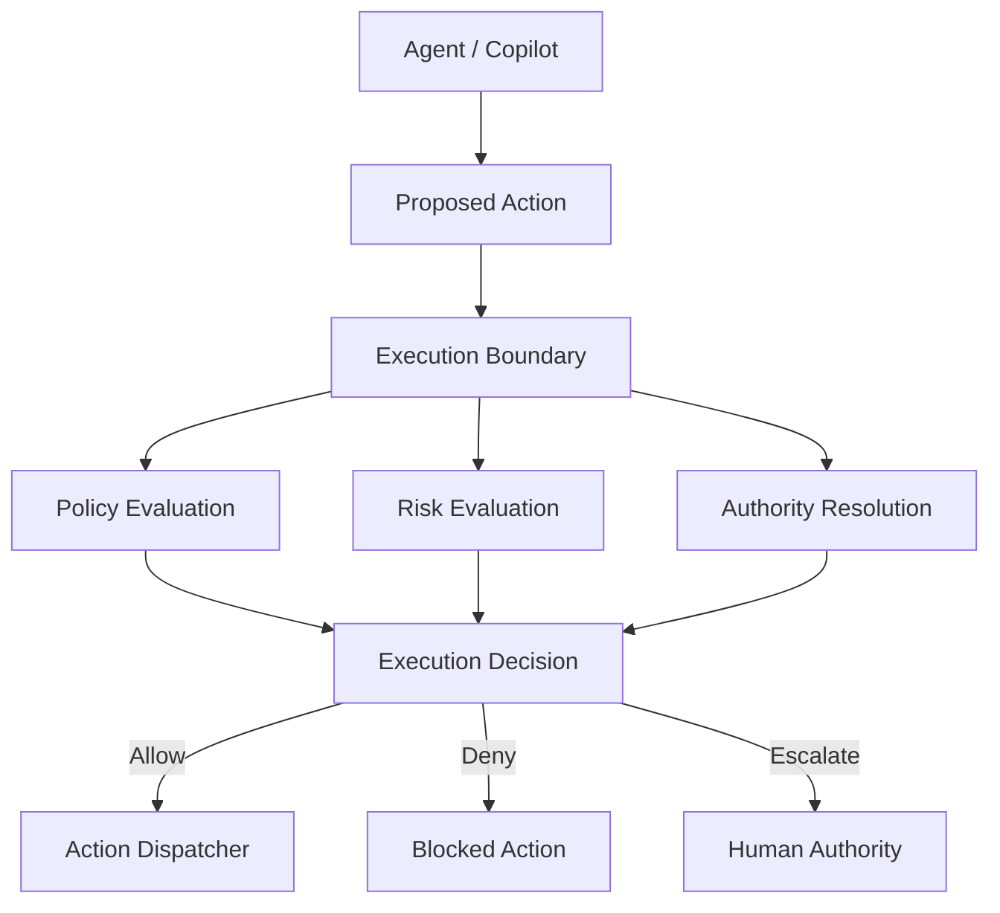

### 5.2 Action-Centric Model

Governance applies to discrete execution actions, not only to prompts, model outputs, or generated text.

### 5.3 Execution Context

Each action is evaluated using runtime context including:

- user identity  
- tenant or organizational scope  
- resource identifiers  
- data sensitivity  
- policy constraints  
- model confidence  
- runtime risk signals  
- prior execution state  

---

## 6. Specification

### 6.1 Action Model

All AI-generated actions SHOULD be normalized into a structured action object.

```json
{
  "action_id": "uuid",
  "action_type": "send_email",
  "actor": {
    "type": "agent",
    "id": "agent_123"
  },
  "requested_by": {
    "type": "user",
    "id": "user_456"
  },
  "target": {
    "resource_type": "email",
    "resource_id": "thread_789"
  },
  "payload": {},
  "context": {
    "tenant_id": "tenant_001",
    "risk_domain": "communications",
    "sensitivity": "external"
  }
}
```

### 6.2 Execution Pipeline

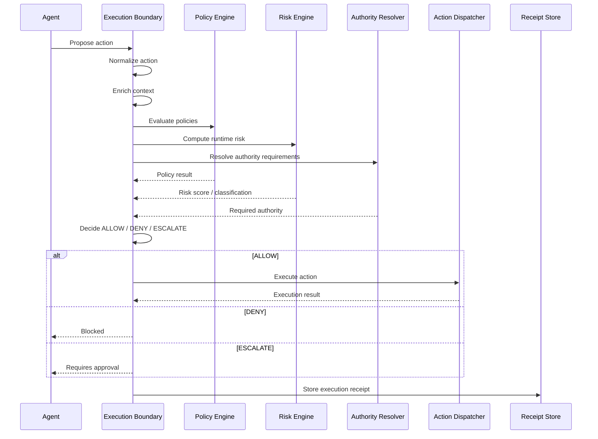

### 6.3 Decision Outcomes

Each action MUST result in one of:

- **ALLOW** — action may execute  
- **DENY** — action is blocked  
- **ESCALATE** — action requires human or authority approval before execution  

### 6.4 Oversight Modes

The system SHOULD support:

- autonomous execution  
- monitored execution  
- approval-based execution  
- blocked execution  

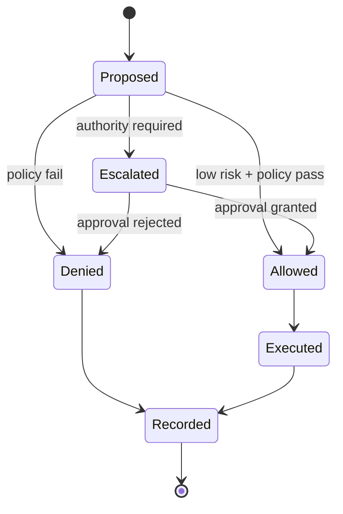

---

## 7. Dynamic Authority Resolution

Static role checks are insufficient for agentic systems because the required authority may depend on runtime context.

Authority SHOULD be resolved dynamically based on:

- action type  
- affected resource  
- affected person  
- regulatory domain  
- operational risk  
- confidence level  
- reversibility of the action  
- business or legal impact  

Example:

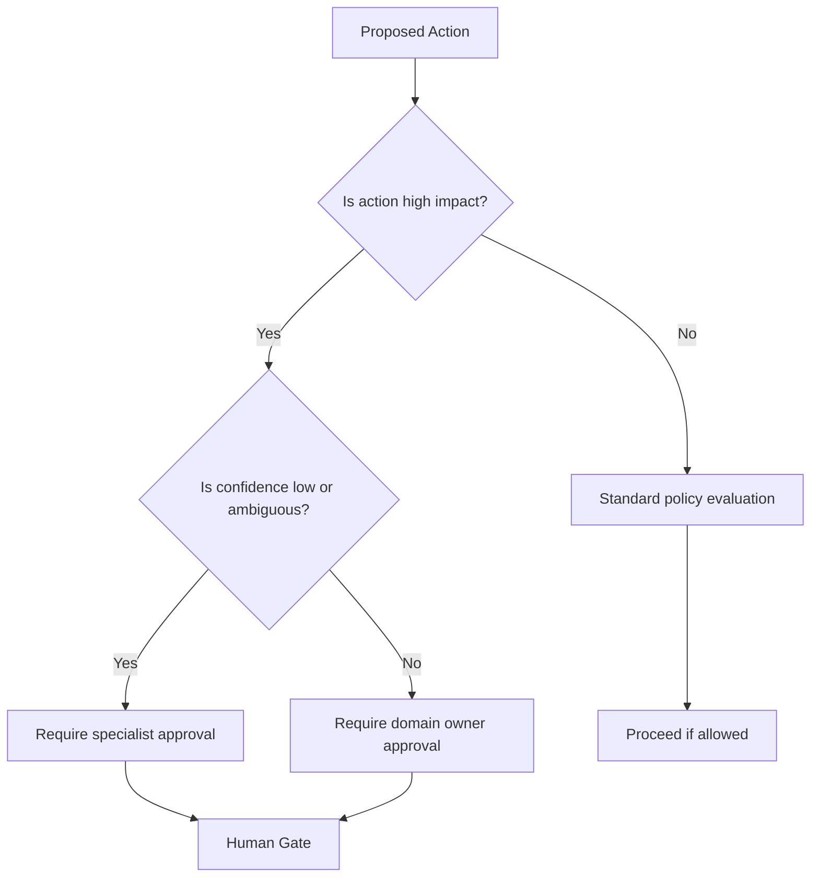

---

## 8. Execution Receipts

Each governed action SHOULD produce an execution receipt.

### 8.1 Receipt Purpose

Execution receipts provide:

- accountability  
- auditability  
- compliance evidence  
- forensic reconstruction  
- debugging support  

### 8.2 Receipt Structure

```json
{
  "receipt_id": "uuid",
  "action_id": "uuid",
  "decision": "ALLOW",
  "policies_applied": [
    "policy.execution.email.external.v1"
  ],
  "risk": {
    "score": 0.41,
    "classification": "medium"
  },
  "authority": {
    "required": false,
    "resolved_by": null
  },
  "execution": {
    "status": "success",
    "timestamp": "2026-05-02T00:00:00Z"
  }
}
```

---

## 9. Execution Provenance Graph

Agentic systems often perform multi-step execution. Each action may depend on prior actions, retrieved data, intermediate outputs, or approval events.

A provenance graph SHOULD capture causal relationships between actions.

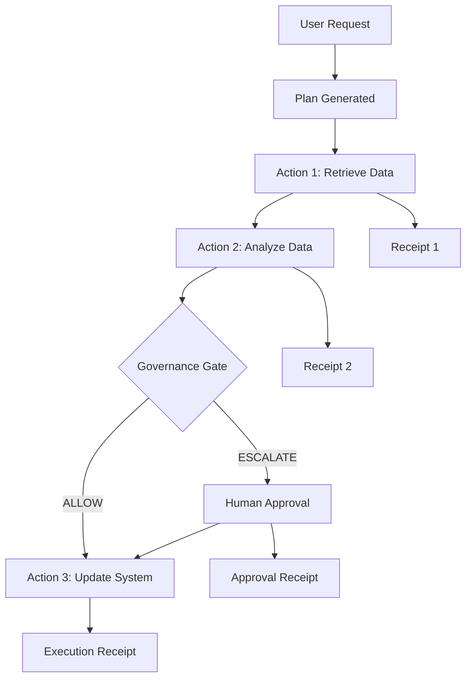

The graph enables:

- tracing why an action occurred  
- identifying downstream consequences  
- detecting drift across repeated executions  
- reconstructing incidents after failure  

---

## 10. System Architecture

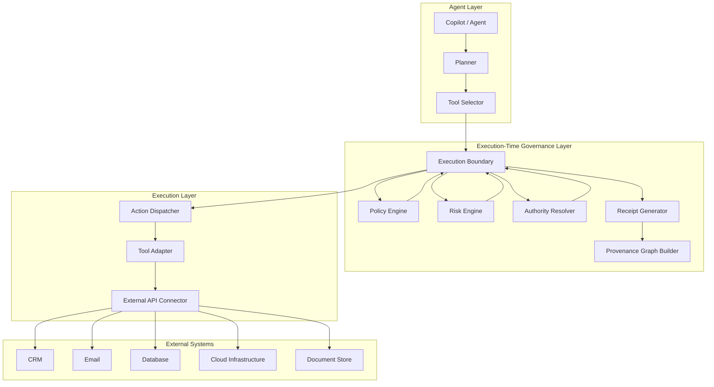

---

## 11. Security Considerations

Security MUST NOT rely solely on:

- prompts  
- model instructions  
- behavioral alignment  
- natural-language constraints  

Security MUST enforce:

- API-level controls  
- least privilege  
- per-action authorization  
- execution isolation  
- credential scoping  
- audit logging  

AI agents must be treated as **non-human identities (NHI)**.

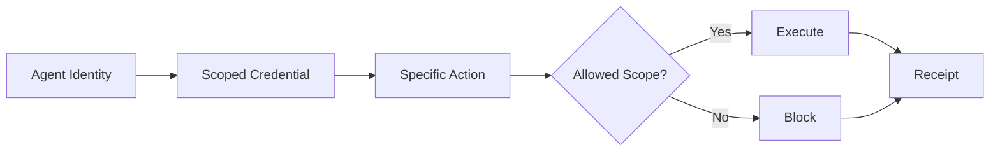

---

## 12. Runtime Behavioral Control

Agents may evolve during execution through:

- memory updates  
- tool-use patterns  
- feedback loops  
- adaptive planning  
- repeated interaction with external systems  

Systems SHOULD implement:

- runtime state versioning  
- policy-bound execution  
- anomaly detection  
- drift monitoring  
- comparison of execution receipts across time  

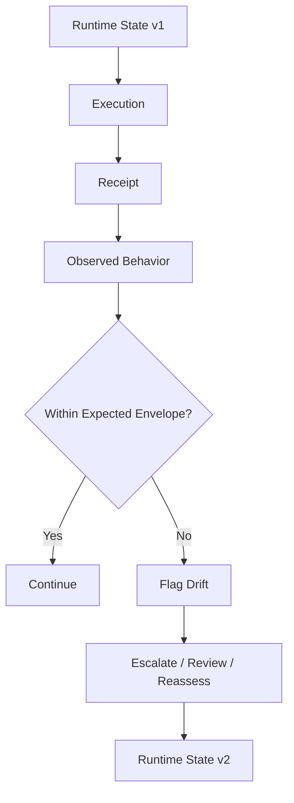

---

## 13. Transparency and Observability

Systems MUST provide:

- full execution traceability  
- decision visibility  
- outcome linkage  
- human approval history  
- policy decision records  

Observability must apply to:

- allowed actions  
- denied actions  
- escalated actions  
- failed actions  
- partially completed execution chains  

---

## 14. Regulatory Alignment

Execution-Time Governance aligns with the direction of modern AI regulation by making runtime action control explicit.

Relevant alignment includes:

- **EU AI Act**  
  - risk management  
  - human oversight  
  - cybersecurity  
  - logging and transparency  

- **GDPR**  
  - accountability  
  - access control  
  - data processing traceability  

- **Cyber Resilience Act**  
  - system-level security  
  - secure execution behavior  

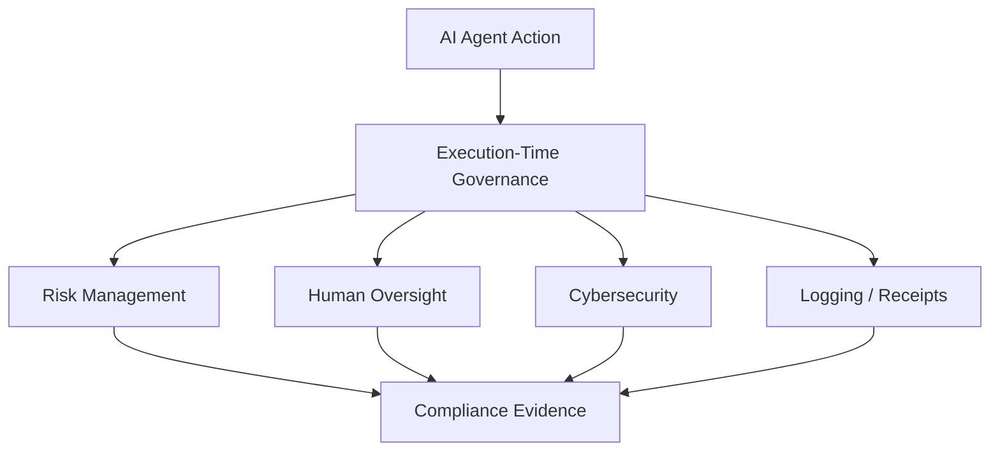

---

## 15. Anti-Patterns

### 15.1 Direct Execution Agents

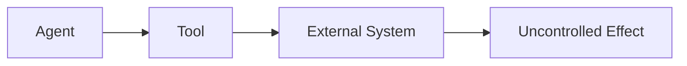

### 15.2 Prompt-Based Governance

Prompt-based governance is insufficient because it is:

- non-enforceable  
- bypassable  
- difficult to audit  
- dependent on model behavior  

### 15.3 Static Roles

Static role systems cannot fully adapt to runtime conditions such as:

- contextual risk  
- affected persons  
- dynamic confidence levels  
- regulatory triggers  
- action irreversibility  

---

## 16. Implications

Execution-Time Governance shifts AI systems from:

- generation systems  

to:

- controlled execution systems  

For organizations, this means:

- governance becomes runtime  
- compliance becomes continuous  
- execution becomes observable  
- responsibility becomes traceable  

---

## 17. Claims Scope (Informal)

This document establishes prior art for:

- execution-time governance architectures  
- runtime enforcement of AI actions  
- action-centric AI system design  
- execution boundaries in AI systems  
- dynamic authority resolution  
- execution receipts  
- execution provenance tracking  
- non-human identity governance for AI agents  
- runtime drift monitoring through execution evidence  

---

## 18. Alignment with Related RFCs

This RFC aligns with:

- **TF-RFC-0001** → Execution Receipts  
- **TF-RFC-0002** → Execution Provenance Graph  
- **TF-RFC-0003** → XPO  
- **TF-RFC-0004** → Execution Governance Model  
- **TF-RFC-0005** → AI Adoption Guidelines  

Together, these documents form a broader execution architecture for AI-enabled systems.

---

## IP & Licensing Considerations

This document is a public disclosure intended to:

- establish prior art for the concepts described herein  
- document authorship and evolution of the proposed models  
- enable open discussion and architectural exploration  

All concepts, models, and frameworks described in this document are:

- authored and published by the author prior to any external engagement  
- part of an ongoing body of work related to execution architecture and AI system design  

### Pre-Existing Intellectual Property

All intellectual property described in this document constitutes **pre-existing work** of the author.

Any future collaboration, consulting engagement, or implementation:

- does not grant ownership over the concepts described herein  
- does not transfer rights to the underlying models, frameworks, or architectural approaches  
- must be governed by explicit agreement if derivative work ownership is to be assigned  

### Scope of Use

This document permits:

- discussion and reference  
- implementation and adaptation of ideas  
- extension within other systems  

However, this document does not grant:

- exclusive rights to the concepts  
- ownership of the original frameworks  
- rights to proprietary implementations derived from the author's work  

### Implementation Distinction

A distinction is made between:

- **Conceptual Models (this document)** → publicly disclosed and attributable  
- **Implementations (systems, platforms, code)** → may be proprietary and independently owned  

### No Implicit Assignment

No rights, ownership, or claims are transferred implicitly through:

- access to this document  
- discussion of its contents  
- application of its ideas  

Any assignment of rights must be:

- explicit  
- documented  
- mutually agreed upon  

---

## License

This document is released under the **Creative Commons Attribution 4.0 International (CC BY 4.0)** license.

You are free to:

- Share  
- Adapt  
- Build upon  

Provided that:

- Proper credit is given to the author.

---

## 19. Final Statement

AI systems must not only decide.

They must be governed at the moment of execution.

> Execution-time governance turns AI from an unconstrained actor into a controlled participant in a governed system.
